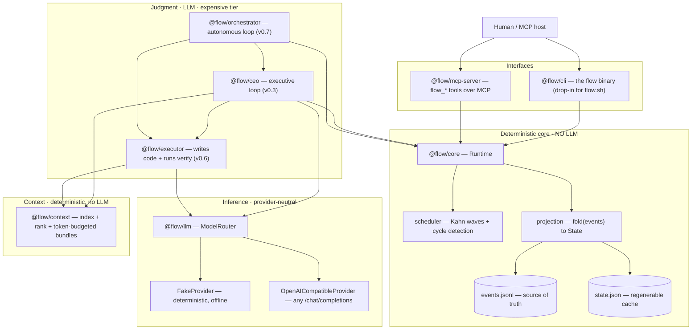
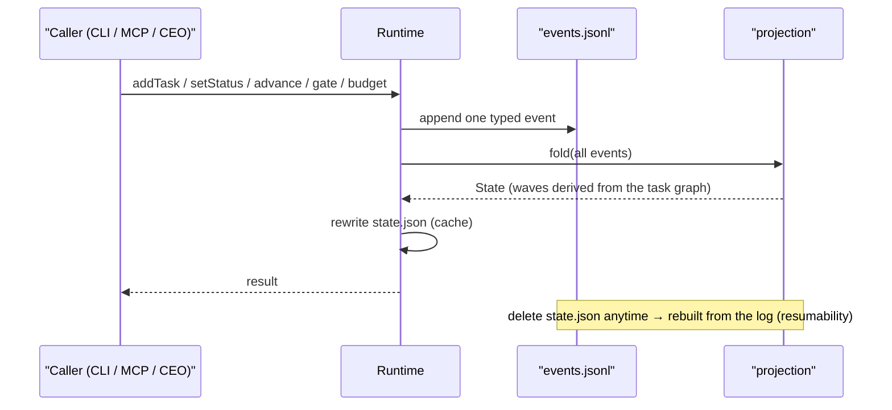
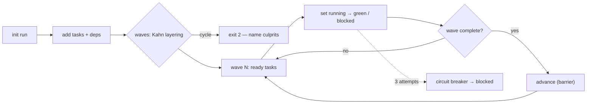
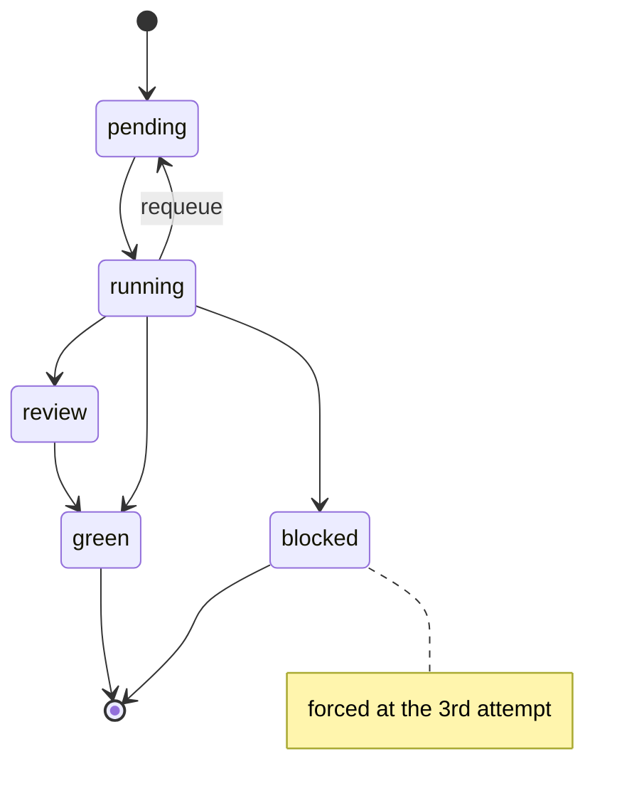

# Architecture — the conceptual map

This is the living map of how `flow-harness` is built: the one idea it rests on, the layers,
how state moves, the run lifecycle, what each package does, where we are, and a guide for
adding to it without breaking its invariants. It doubles as the development README — keep it in
sync as the harness grows. (Diagrams render on GitHub via Mermaid.)

## The one idea

**Deterministic control flow lives in code; judgment lives in the LLM.** The runtime owns
orchestration, state, scheduling and cost — all reproducible, all testable without a model. The
LLM is an interchangeable engine that decides *what* should happen; the runtime decides *how* it
happens, safely and repeatably. Every layer below preserves that split.

## Layered map

The **brain** (CEO) reads the deterministic core's state and calls the inference layer to decide
the next move; it never edits product code and never mutates state except through the core's
typed commands. Humans reach the system through either interface; both speak only to the core.

## How state moves (event sourcing)

`events.jsonl` is the durable truth. `state.json` is a projection you can delete at any time —
it is rebuilt by folding the log. This is what makes runs resumable and auditable.

Policy that reacts to a transition (the circuit breaker) lives in the command layer and is
recorded as a *second* event, so the projector stays a dumb, pure fold.

## The run lifecycle (DAG + waves)

A task's own state machine:

## Packages

| Package | Role | Depends on | Status |
|---|---|---|---|
| `@flow/core` | Event-sourced runtime: event log, projection, Kahn scheduler, state machine + circuit breaker, ledger, gates. **No LLM.** | — | ✅ v0.1 |
| `@flow/cli` | The `flow` binary; a drop-in for `flow.sh`. | core | ✅ v0.1 |
| `@flow/mcp-server` | MCP server exposing 13 high-level `flow_*` tools (incl. `flow_execute`, and `flow_spec`/`flow_converge` — the SDD planner + convergence over MCP); any host can drive a run. | core, MCP SDK | ✅ v0.4 / v0.16 |
| `@flow/llm` | Provider-neutral inference: `LLMProvider`, `FakeProvider`, `OpenAICompatibleProvider`, `AnthropicProvider`, `ModelRouter`, `routerFromEnv`. Per-tier provider/model, retry/backoff, and **automatic fallback** (a tier's primary fails → auto-switch to its backup). Zero deps. | — | ✅ v0.2 / v0.2.4 |
| `@flow/ceo` | Executive loop: observe state → decide next move via the LLM, **with recalled lessons + repo context in its prompt**. Never edits code. | core, llm | ✅ v0.3 |
| `@flow/context` | Deterministic, LLM-free repo index + relevance ranking + token-budgeted context bundles. | — | ✅ v0.5 |
| `@flow/executor` | Writes **and edits** (safe search/replace) code, then runs the verify command. The only writer of product code. | llm, context | ✅ v0.6 |
| `@flow/orchestrator` | The conductor: CEO → executor → runtime, with a **repair loop** (retry a failed verify by feeding the error back), **risk gating** (high-risk → human review), and lesson recording. `flow-run <config.json>`. | core, ceo, executor, llm, context, memory, review | ✅ v0.7 |
| `@flow/memory` | Append-only lessons store + relevance search (reuses the context tokenizer) — the CEO's memory across runs. `flow-run` records one lesson per run. **Authored by the harness itself.** | context | ✅ v0.8 |
| `@flow/review` | Deterministic risk/review engine: `assessRisk` → level, review depth, model tier, human gate. **Self-built.** | — | ✅ v0.9 |
| `@flow/planner` | Spec-Driven Development planner (GitHub Spec Kit): objective → spec (requirements + acceptance + clarifications) → ordered task DAG with per-task verify. **Self-built (CEO on Gemini).** Wired into `flow-run` (objective → plan → gate → execute). | llm | ✅ v0.12 |
| `@flow/converge` | SDD Converge/Analyze: `converge(plan, outcomes)` → deterministic done-vs-spec report (green/pending, complete, open clarifications). **Self-built.** | planner | ✅ v0.14 |
| `@flow/git` | Git worktree wrapper (spawnSync, no shell): createWorktree, commitAll, changedFiles… — isolates a run on its own branch. **Self-built (first try).** `flow-run "worktree": true` → the run's changes land on `flow/<runId>` for a PR, working tree untouched. | — | ✅ v0.15 |
| `@flow/qa` | Deterministic QA engine (Layer A): `runQA` verifies each acceptance criterion with its own explicit command (spawnSync, no shell), writes evidence artifacts, and emits a report + error tickets. Independent, run-less, offline; lib + bin `flow-qa`. Emits evidence/verdicts/tickets, not decisions. **Self-built.** | — | ✅ v0.18 |

Runtime is Node ≥ 22 + TypeScript (ESM, `NodeNext`), npm workspaces, `tsc -b`. Everything runs
in Docker (`docker compose run --rm test | flow | mcp | llm`). See [`docs/decisions`](docs/decisions)
for the ADRs and [`STATUS.md`](STATUS.md) for the milestone tracker.

### Why TypeScript, not Python

The core job is orchestration, state, protocol and browser automation — TS strengths. MCP (our
interoperability boundary) is TS-first; Playwright (browser/mobile QA) is Node-native; one typed
language spans runtime, CLI, MCP server and a future web dashboard; and the LLM is reached over
HTTP (OpenAI-compatible), so provider-agnosticism needs no Python SDK. Where Python leads —
in-process ML/data — the harness doesn't need it in the core; such work plugs in behind an
adapter or its own MCP server (PLAN §4). The choice is reversible at the edges, not the core.

## Guide for improvements

Extend along the seams; keep the invariants.

- **Add an inference backend** → a new `LLMProvider` in `packages/llm/src/providers/`, wired in
  `routerFromEnv`. Most backends already work through `OpenAICompatibleProvider` (set
  `FLOW_LLM_BASE_URL`) — OpenRouter, Groq, Together, Mistral, vLLM, LM Studio and Ollama all plug in
  as-is; only a genuinely different API needs a new class. Declare one as a per-tier
  `FLOW_LLM_<TIER>_FALLBACK_*` for automatic overflow when the primary saturates.
- **Add an orchestration capability** → a new event type in `@flow/core` (`events/types.ts`),
  handled in the projector (`projection/project.ts`) and emitted by a `Runtime` method. Never
  mutate `state.json` directly.
- **Expose it to hosts** → a new tool in `@flow/mcp-server` (`tools.ts`) — high-level and
  intent-shaped, never a raw state mutation.
- **Give the brain more autonomy** → widen the CEO's action set in `@flow/ceo`, but keep human
  gates the default for anything with an external side effect, and keep it unable to edit code.

**Invariants that must not bend:** the core stays LLM-free and deterministic; `events.jsonl` is
the only source of truth; the projector is a pure fold; model-reported confidence is *not*
trusted for routing without external verification; and every diff is verified by the plan's done
criteria (build + tests in Docker), not by an agent's say-so.

## Where this is going

The autonomous loop is closed and, increasingly, capable: `flow-run` drives objective → **planner**
(spec + task DAG) → human gate → CEO → executor → runtime, the CEO reasons with **memory + context**,
the executor **edits real code**, a **repair loop** lets runs converge on failures, **provider
fallback** rides through saturation, and each run can be **isolated on its own git worktree/branch**
for a PR gate — all proven against real backends (Groq, Gemini, Mistral, and the CEO on Claude in a
multi-LLM run), the **planner + convergence are exposed over MCP** (`flow_spec`/`flow_converge`, v0.16,
self-built), and the **executor is hardened** (atomic apply; a total provider failure blocks the task instead of
aborting the run — v0.17, self-built), and the **QA engine has its deterministic first layer** (`@flow/qa` —
per-criterion evidence + error tickets, standalone, v0.18, self-built). Next: **QA Layer B (Playwright web)** +
wiring tickets into a CEO-driven fix loop, then an **evaluation harness** (score runs against acceptance) ·
**controlled learning** (promote lessons) · **graph memory** · MCP resources & apps · remote deployment. The end state: point the harness at its own repository and let it build its next
increments — which only works because the spine beneath it is deterministic, resumable and auditable.
The prioritized execution plan (17 capabilities, dependency-ordered, status-tagged) and the project's
headline metric — an autonomous, evidence-verified web-app build repeated across specs — live in
[`plans/ROADMAP.md`](plans/ROADMAP.md); [`PLAN.md`](PLAN.md) remains the architecture treatise.
